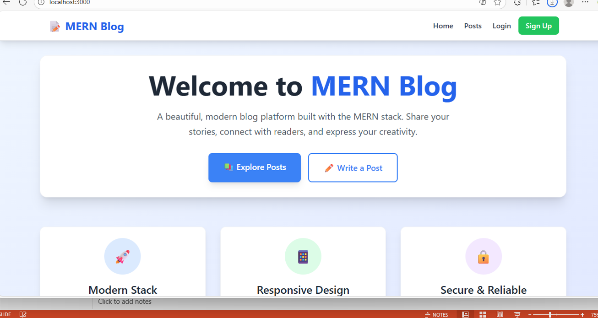
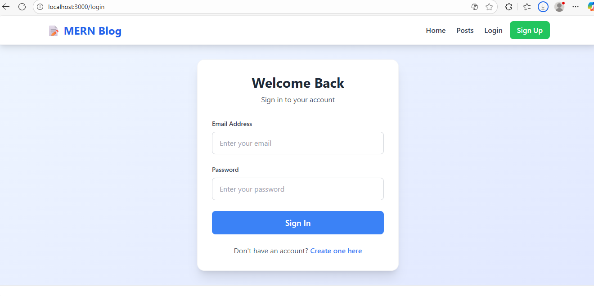

# MERN Stack Blog Application

A full-stack blog application built with MongoDB, Express.js, React.js, and Node.js.

## 🚀 Features

- ✅ User authentication (Register/Login)
- ✅ Create, read, update, delete blog posts
- ✅ Responsive design with Tailwind CSS
- ✅ MongoDB Atlas for database
- ✅ JWT authentication
- ✅ RESTful API architecture

## 🛠️ Tech Stack

- **Frontend**: React, Vite, Tailwind CSS, React Router
- **Backend**: Node.js, Express.js, MongoDB, Mongoose
- **Authentication**: JWT, bcryptjs
- **Deployment**: Vercel (Frontend), Render/Railway (Backend)

## Screen Shots



## 📁 Project Structure
blog-app/
├── client/ # React frontend
│ ├── src/
│ │ ├── components/ # Reusable components
│ │ ├── pages/ # Page components
│ │ ├── context/ # React context
│ │ ├── hooks/ # Custom hooks
│ │ └── App.jsx # Main App component
│ ├── package.json
│ └── vite.config.js
├── server/ # Express backend
│ ├── models/ # Mongoose models
│ ├── routes/ # API routes
│ ├── middleware/ # Custom middleware
│ ├── package.json
│ └── server.js
└── README.md


## 🏃‍♂️ Quick Start

### Prerequisites
- Node.js (v18 or higher)
- MongoDB Atlas account
- Git

### Installation

1. **Clone the repository**
   ```bash
   git clone <your-repo-url>
   cd blog-app
